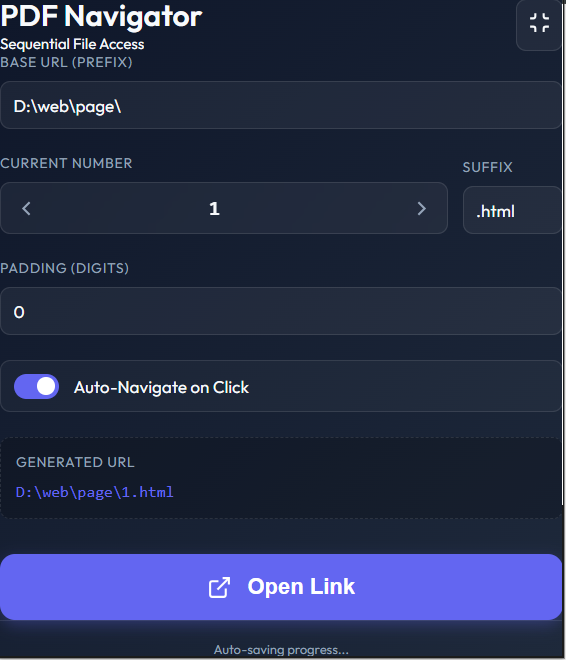
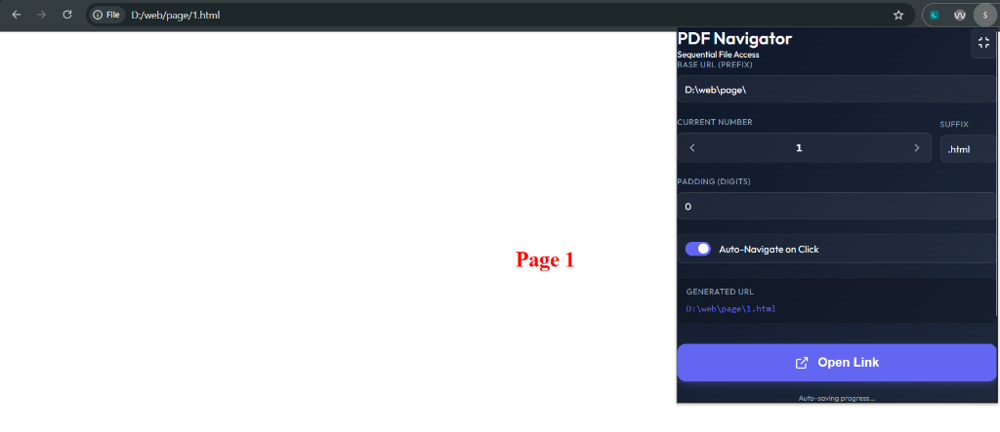
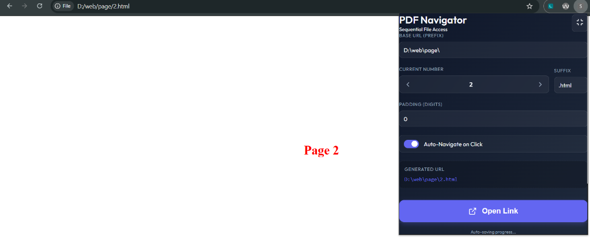

# 🚀 Sequential PDF & File Navigator

A professional, lightweight, and modern Chrome Extension designed to streamline sequential file access and navigation. Whether you are reading numbered PDFs, browsing sequential local HTML pages (e.g., `D:\web\page\1.html`), or scrolling through numbered web assets, this extension automates the URL generation and navigation process with precision.

---

## 📸 Screenshots

| 🔍 Extension Panel | 📂 Active Page Navigation (Page 1) |
|:---:|:---:|
|  |  |

| 📂 Active Page Navigation (Page 2) |
|:---:|
|  |

---

## ✨ Features

- **Smart URL Parsing:** Automatically detects and extracts the base URL, current number, padding, and file extension from your active tab.
- **Dynamic Padding Support:** Flexibly pad numbers with leading zeros (e.g., `01`, `001`, `0001`) to match any file-naming convention.
- **Auto-Navigation:** Instantly redirects the current browser tab to the next or previous file upon clicking the navigation arrows.
- **Manual Launching:** Preview the target URL dynamically and open it with a single click.
- **State Persistence:** Automatically remembers your configuration values across sessions.
- **Compact View:** Easily toggle between full and compact UI modes to save screen real estate.

---

## 📁 Project Structure

```bash
pdf-navigator-extension/
├── images/                  # Screenshot assets for documentation
│   ├── image1.png           # UI Control Panel screenshot
│   ├── image2.png           # Page 2 navigation screenshot
│   └── image3.png           # Page 1 navigation screenshot
├── manifest.json            # Extension configuration (Manifest V3)
├── popup.html               # Main user interface layout
├── popup.css                # Premium styling (Outfit font, smooth transitions)
└── popup.js                 # URL parsing, padding, and navigation logic
```

---

## 🛠️ Configuration Guide

The extension provides a clean interface with the following configurable options:

| Field | Description | Example / Usage |
|:---|:---|:---|
| **Base URL (Prefix)** | The common, static prefix of the file path or web URL. | `D:\web\page\` or `https://example.com/files/` |
| **Current Number** | The active file index or page number. Use arrow buttons (`<` and `>`) to decrement/increment. | `1` or `121` |
| **Suffix** | The file extension or URL ending. If left blank, only the number is appended. | `.html` or `.pdf` (Leaves empty if no extension: `D:\web\page\1`) |
| **Padding (Digits)** | The total character length of the number. It pads with leading zeros. | If set to `3`, number `1` becomes `001`. Set to `0` or `1` for no padding (e.g. `12` or `121`). |
| **Auto-Navigate on Click** | When enabled, clicking the back/next arrows immediately loads the new URL. | Toggle **ON** for automated browsing, **OFF** to manually review. |
| **Generated URL** | A real-time preview of the target URL to be opened. | `D:\web\page\1.html` |
| **Open Link Button** | Clicking this manually loads the generated URL in the current tab. | Click to navigate if Auto-Navigate is OFF. |

---

## 📦 Installation & Setup

### Option 1: Install from Release Package (Zip / Exe / App)

1. **Download the Release:** 
   Download the latest release zip file: [pdf-navigator-extension.zip](https://github.com/PTharanan/pdf-navigator-extension/releases/download/v1.0.0/pdf-navigator-extension.zip)

2. **Install Zip Archive (All Platforms):**
   * Extract the downloaded `pdf-navigator-extension.zip` file to a permanent folder on your computer.
   * Open Google Chrome and navigate to `chrome://extensions/`.
   * Enable **Developer mode** using the toggle switch in the top-right corner.
   * Click the **Load unpacked** button in the top-left corner.
   * Select the folder where you extracted the extension files (the directory containing `manifest.json`).

*   **For Desktop Companion Apps (`.exe` / `.app`):**
    *   Simply run the installer executable (`.exe` on Windows, `.app`/`.dmg` on macOS) and follow the installation wizard instructions to set up the companion background helper.

---

### Option 2: Installation for Developers
To load and run the extension from source:

1. Clone or download this repository to your local machine:
   ```bash
   git clone https://github.com/your-username/pdf-navigator-extension.git
   ```
2. Open Google Chrome and go to `chrome://extensions/`.
3. Enable **Developer mode** (top-right toggle).
4. Click **Load unpacked** and select the cloned repository folder.

---

## 💡 How to Use

1. Click on the **PDF Navigator** icon in your Chrome toolbar to open the popup.
2. If you are already viewing a sequential page (e.g. `D:\web\page\121.html`), the extension will **automatically detect** the format.
3. If it is not automatically detected, fill out the settings:
   - **Base URL:** `D:\web\page\`
   - **Current Number:** `1`
   - **Suffix:** `.html`
   - **Padding (Digits):** `1`
4. Toggle **Auto-Navigate on Click** to your preference.
5. Click the `>` button to advance to page `2` (`D:\web\page\2.html`). The tab will load the new page instantly!
